# ML-TOOLBOX:

> This repo contains different different ml projects and tools for daily use.

> For front end - html, css, javascript.

> For backend - flaskserver

---

---

# ML Projects

> 1. Olympians Recognizer - This is an image recognizing project using `opencv` and `logistic regression` (`svm` also worked well but it used it because it gave me more score). - By [Prince Mishra](https://www.linkedin.com/in/prince-mishra-7379101ab/)

---

# Tool Box

---

# Installation

> [Python](https://www.python.org/downloads/) - `Python 3.9+ verion`

> `pip install -r requirements.txt`

> [VS Code](https://code.visualstudio.com/download)

> [Liveserver Extension](https://marketplace.visualstudio.com/items?itemName=ritwickdey.LiveServer)

---

# Running

> in terminal type `python ./server/server.py`

> run `clients/index.html` using liverserver

---

# Steps To Add New Project

> 1. Make a new branch and work under it - [Link](https://www.atlassian.com/git/tutorials/using-branches/git-checkout)

---

> 2. To work on your `project` make a `folder` as unique name not used before. Example:
I have worked on `olympians_recognizer` and done my work in it

> 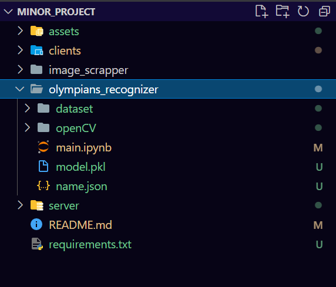

---

> 3. Then paste that `model` (`dumped` before using `pickle` or `joblib`) or other required `files` in `./server/artifacts/project_name`.

> 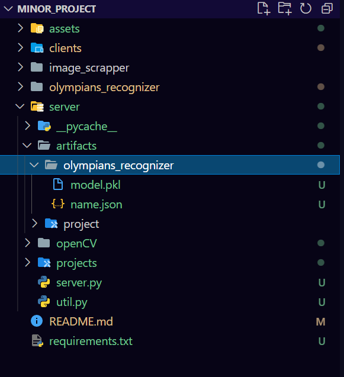

> here you can easily see i have created a new folder as `olympians_recognizer` under `./server/artifacts/` and pasted my required files there

---

> 4. Create a new folder under `./server/projects` as same name as you project and make two files in it as `server.py` and `util.py`:

> 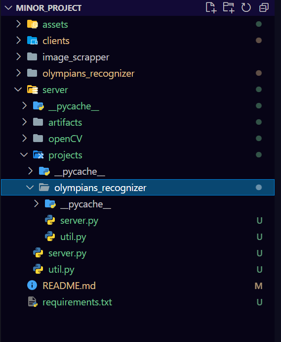

> in `server.py` file you have to declare app in different manner you can take reference from `./projects/olympics_recognizer/server.py' as shown

> 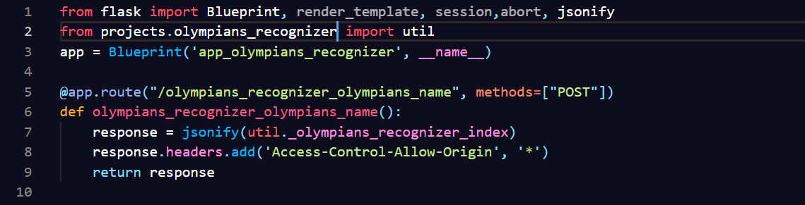

> in `url.py` you have to declare the function that can load saved artifacts with name `load_saved_artifacts()` as shown

> 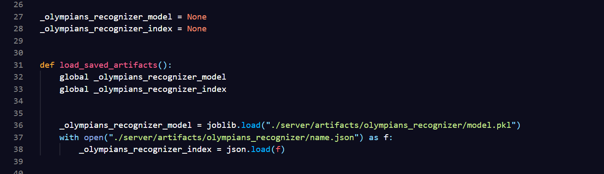

---

> 5. In `./server/server.py` import these files and register them as shown below:

> 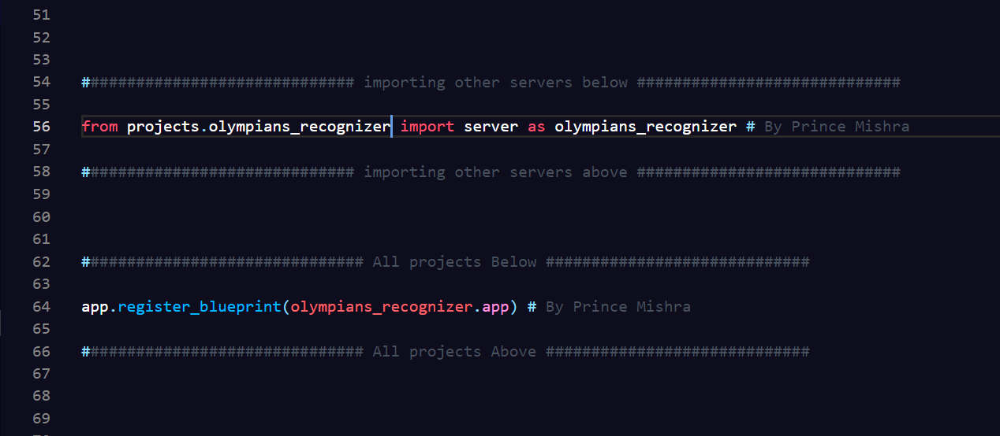

---

> 6. Load you model and other data in `./server/util.py` function

> 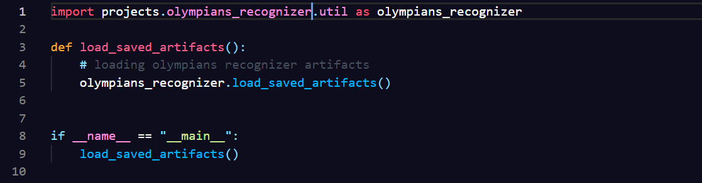

---

> 7. Create `app.html`, `app.css`, `app.js` in `./clients/common/project_name`:

> 

> here you can see I have made a folder in `common` folder and added three files `app.html`, `app.css`, `app.js` and now copy the content `./clients/base.html` and paste it into `./clients/common/project/app.html` and now you can start your work from line no 98 in app.html, `app.js` and `app.css` are already linked in `app.html` so no need to again link them.

> 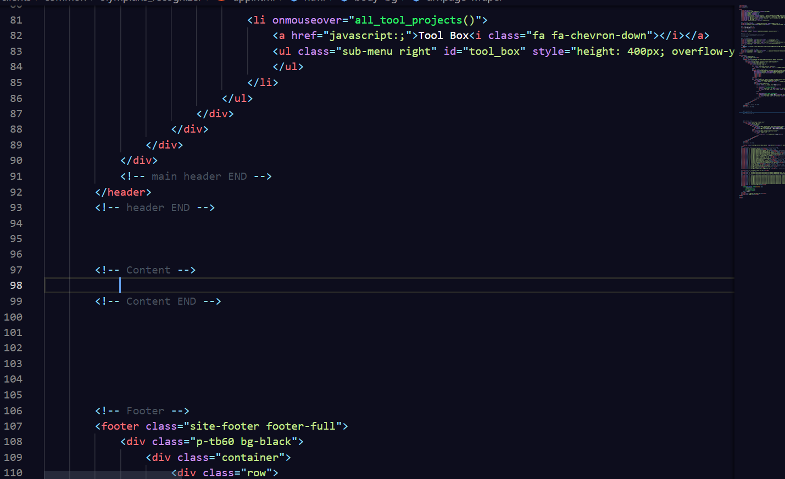

---

> 8. Add you project in `./server/server.py` file under ml_box or tool_box based on your kind of project as shown `(from line no 9)`:

> 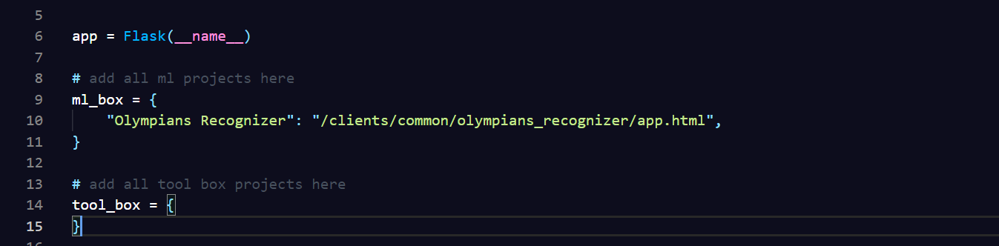

> ml_box = {
>
>                ......................,
>                ......................,
>                "Olympians Recognizer": "/clients/common/olympians_recognizer/app.html",
>}`

> Here `Olympians Recognizer` is the option that will we shown in the html pages under navbar as:

> 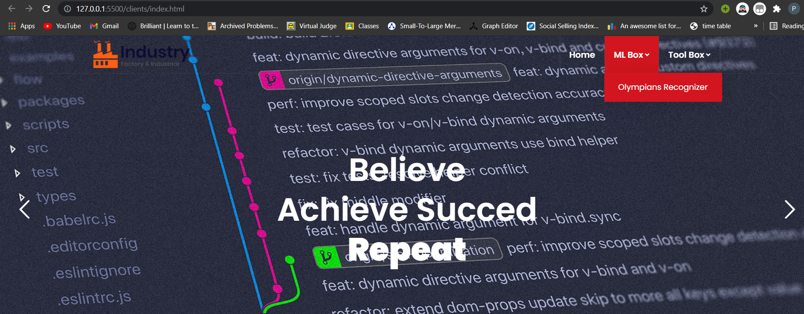

> Here `/clients/common/olympians_recognizer/app.html` is the location of html page that you made for your project. You just need to change the `olympians_recognizer` with you project_name and everything will be same 

---

> 9. Make your links (apis) in `./server/projects/project_name/server.py`

> 

> Please follow a rule to write your apis: that is always write your project_name before your api name as done above otherwise it may cause collision between apis. 😃

> Also a good practice is to define your function in `./server/projects/project_name/util.py` and use them in `./server/projects/project_name/server.py`

----

> 10. You can store the images (static files) in `./clients/projects/project_name`

> 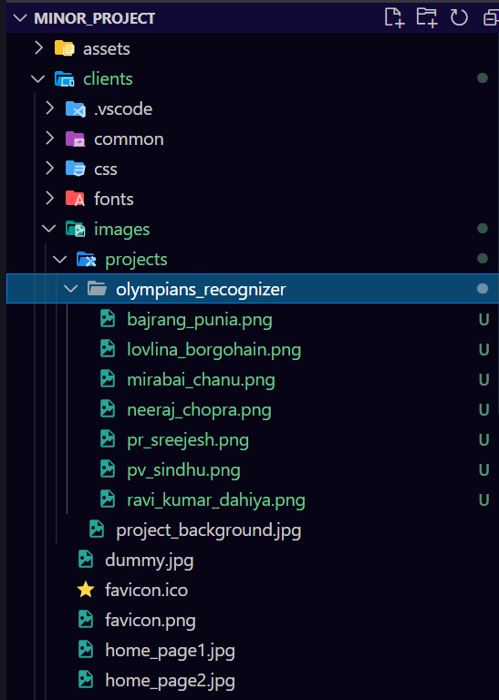

---

> 11. After that complete you work in front end (html, css, js). It is highly advised to not use your own css rather use the css provided in template folder. Otherwise it will create a lot of mess, and our website willn't remain responsive.😑

> Done you work in `server.py` and `util.py` in `./server/projects/project_name`, then just write about your project in README.md and provide your name and linkedin account link as shown

> 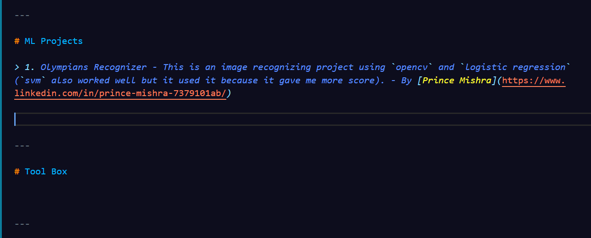

> open `./clients/index.html` and add your project into it project section

> 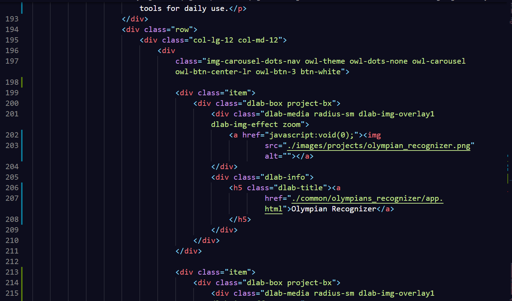

> like I have added my project `olympians_recognizer` from line number 199 to 211, below it i have also added a dummy project you just need to copy it and replace `dummy pic` with the `screenshot` of your project which must have dimensions as `500 X 700` and `link` as the link to your `project app.html` page

> then just `commit` your changes and merge with `master branch`

FOOTNOTE: You can take reference from olympians_recognizer, in master branch.

---

# 😍CONGRATULATIONS ONE MORE PROJECT DONE😍

---
